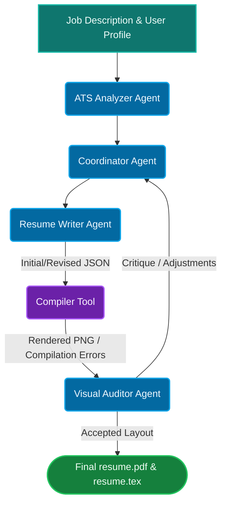

# AGENT SPECIFICATION: AUTONOMOUS MULTIMODAL RESUME BUILDER

## 1. System Vision & Objective
This repository is an autonomous, layout-aware, self-healing resume optimization engine. It takes a comprehensive master profile (Markdown format) and a target job description, tailors the contents for maximum ATS semantic matching, and runs a class-based multi-agent feedback loop to ensure the final resume compiles to exactly one page with a balanced layout and correct margins.

### Core Architectural Mandate
- **Immutable Layout**: LaTeX margins, line spacing, font configurations, and vertical spacing are static. 
- **Content-Driven Layout Corrections**: The agents must **never** modify spacing variables (`\vspace`, `\vfill`) or margins to fix height violations.
- **Self-Healing Loop**: All spatial and layout constraints must be resolved dynamically by adjusting the text volume and density (e.g., shortening or expanding bullet points) through the cooperative agent feedback loop.

## 2. Technical Stack
- **AI Models**: Google Gemini API (via the `google-generativeai` SDK).
- **Backend Orchestrator**: Flask (Python 3.11+) running local compilation and page routing scripts.
- **Typesetting Engine**: XeLaTeX (via local subprocess compilation).
- **PDF Manipulation & Rasterization**: PyMuPDF (`fitz`).
- **UI Dashboard**: HTML5, Vanilla CSS for maximum styling flexibility and control, JavaScript with Server-Sent Events (SSE) for live agent logs, Chart.js for real-time diagnostics, and custom drag splitters for resizable panel divisions.

## 3. Multi-Agent Team Architecture
The system has been restructured from a rigid procedural pipeline into a robust, class-based **Multi-Agent Collaboration Network**:

- **Coordinator Agent (`agents/coordinator.py`):** Acts as the supervisor, guiding the optimization flow, handling intermediate variables, and invoking external programmatic tools.
- **ATS Analyzer Agent (`agents/ats_analyzer.py`):** Scores profile alignment against the job description, detects missing skills, and selects target keywords.
- **Resume Writer Agent (`agents/resume_writer.py`):** Formats experience blocks, dynamically injects target keywords, and shortens/lengthens bullet points to comply with layout boundaries.
- **Visual Auditor Agent (`agents/visual_auditor.py`):** Utilizes multimodal vision to review the final spacing, margins, orphan lines, and general visual layout of the rendered page.
- **Compiler Tool (`stages/stage2_pdf_manager.py`):** Programmatic tool that compiles LaTeX source using XeLaTeX, catches typographic warnings, and generates high-resolution page previews.
