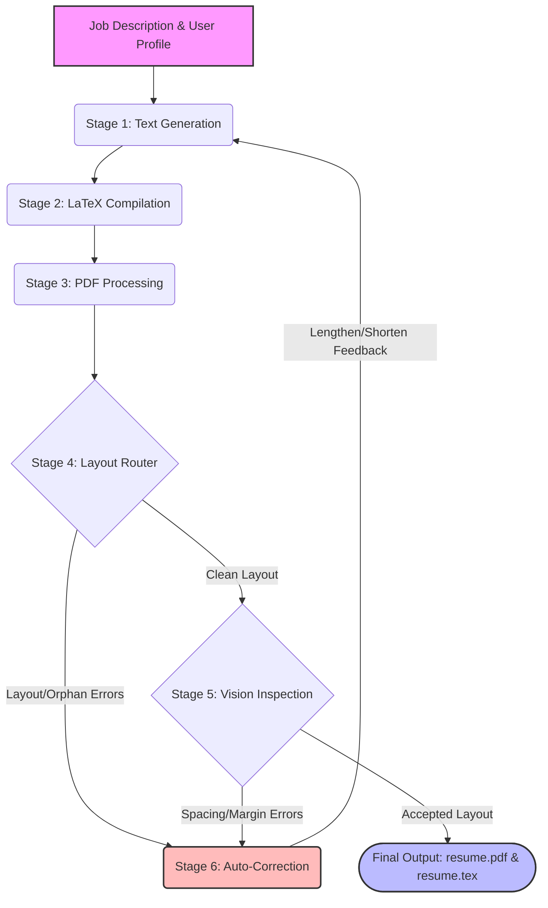

# Multimodal Resume Compiler

An autonomous, auto-correcting pipeline for tailoring and optimizing resumes. It leverages the power of Large Language Models (LLMs) and Multimodal Vision APIs to iteratively rewrite, format, and compile highly-tailored, ATS-friendly LaTeX resumes against specific job descriptions. 

The system detects visual and typographic layout issues (like orphan bullet points and uneven margins) and iteratively refines the text to produce a visually perfect, single-page PDF.

## Architecture Flow



## How to Run

1. **Install Dependencies:**
   ```bash
   make install
   # or run: pip install -r requirements.txt
   ```

2. **Set up Environment:**
   Ensure you have your `.env` file configured with your Gemini API keys.
   ```bash
   GEMINI_API_KEY=your_key_here
   ```

3. **Start the Application:**
   Run the Flask UI and orchestration server:
   ```bash
   make run
   # or run: python app.py
   ```

4. **Access the Web Interface:**
   Open your browser and navigate to `http://127.0.0.1:5000` to monitor and run the compilation pipeline.

## Other Commands

- `make compile` - Manually compile the LaTeX resume.
- `make clean` - Clean up output and build files.