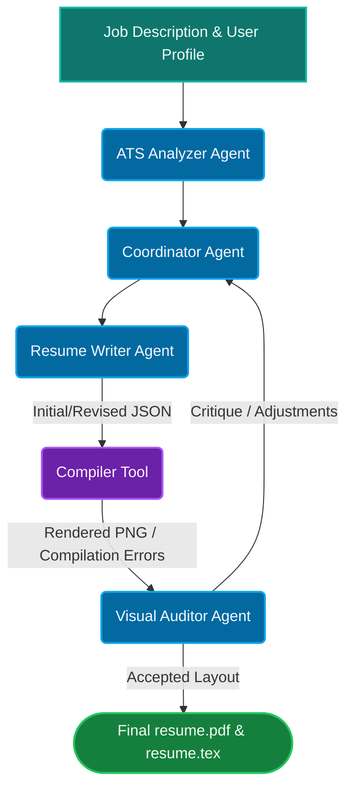

# Multimodal Resume Compiler

An autonomous, auto-correcting multi-agent system for tailoring and optimizing resumes. It leverages the power of Large Language Models (LLMs) and Multimodal Vision APIs to iteratively rewrite, format, and compile highly-tailored, ATS-friendly LaTeX resumes against specific job descriptions.

The system utilizes specialized cooperating agents overseen by a coordinator to detect visual, typographic, or content gaps, refining the document until it compiles perfectly to a single-page PDF.

## Multi-Agent Architecture



## Prerequisites

Before running the application, ensure you have a LaTeX distribution with `xelatex` installed on your system:
- **macOS:** Install MacTeX (`brew install --cask mactex-no-gui`) or BasicTeX.
- **Linux:** Install TeX Live (`sudo apt-get install texlive-xetex` / `texlive-fonts-recommended`).
- **Windows:** Install MiKTeX or TeX Live.

## How to Run

1. **Install Dependencies:**
   ```bash
   make install
   # or run: pip install -r requirements.txt
   ```

2. **Set up Environment:**
   Ensure you have your `.env` file configured with your Gemini API keys.
   ```bash
   GEMINI_API_KEY=your_key_here
   ```

3. **Start the Application:**
   Run the Flask UI and orchestration server:
   ```bash
   make run
   # or run: python app.py
   ```

4. **Access the Web Interface:**
   Open your browser and navigate to `http://127.0.0.1:5001` to monitor and run the compilation pipeline.

## Other Commands

- `make compile` - Manually compile the LaTeX resume.
- `make test` - Run automated tests.
- `make clean` - Clean up output and build files.

## Customizing the Template

For step-by-step instructions on how to use an external LLM to update the LaTeX resume layout, formatting, or data fields, see the [LaTeX Template Customization Guide](.agents/10_update_latex_template.md).

## Notes
- Cancellation is request-scoped via `run_id` (passed to `/stream` and `/api/cancel`).
- Default resume compile can be triggered explicitly via `POST /api/compile-default`.
